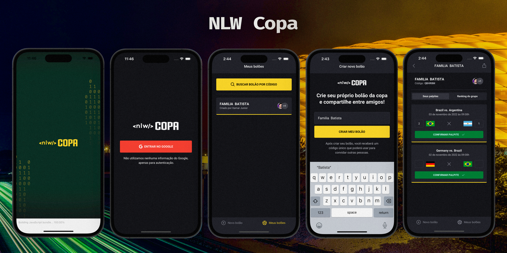

# Next Level Week - Copa

Projeto feito durante a Next Level Week da Rocketseat, com o intuito de criar uma plataforma de gerenciamento de bolões dos jogos da copa 2022.

## Tecnologias

- [Node.js](https://nodejs.org/en/)
- [React](https://reactjs.org/)
- [React Native](https://reactnative.dev/)
- [Expo](https://expo.io/)
- [TypeScript](https://www.typescriptlang.org/)

## Como rodar

Primeiro precisa executar o backend, para isso, faça o clone do repo: `git clone
https://github.com/jrbytes/nlw-copa-server` como o banco de dados está em SQLite, não é necessário configurar nada, basta executar o comando `npm run dev` para iniciar o servidor.

Depois que o backend estiver rodando, execute o mobile com o comando `expo start`.

Porém, para ter acesso a todas as telas, é necessário adicionar a variável de ambiente CLIENT_ID. Para isso, crie um novo projeto no Google Cloud, em API e Serviços, ativar um client OAuth 2.0 e copiar o ID do Client. Os dados para adicionar nessa criação são a URI do auth.expo.io e a uri de redirecionamento baseado no seu login expo `auth.expo.io/@seu_login/nlw-copa-mobile`. Na tela de consentimento os escopos devem ser: `profile` e `email`.